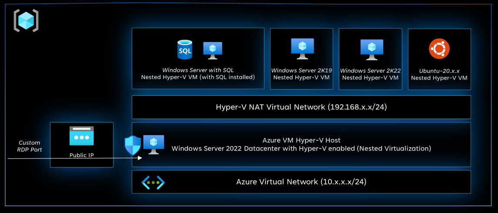
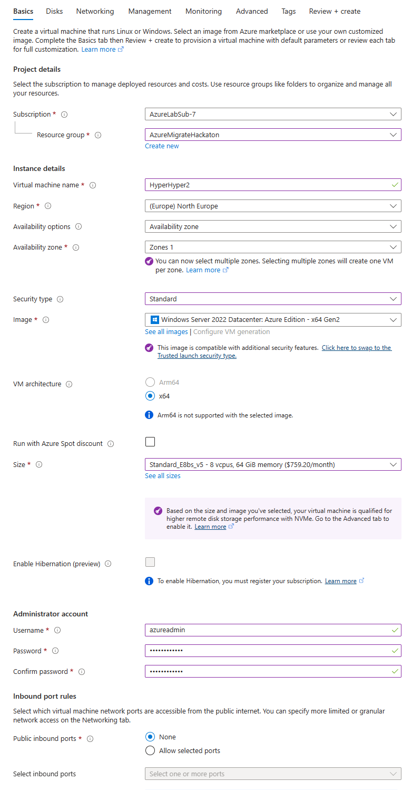
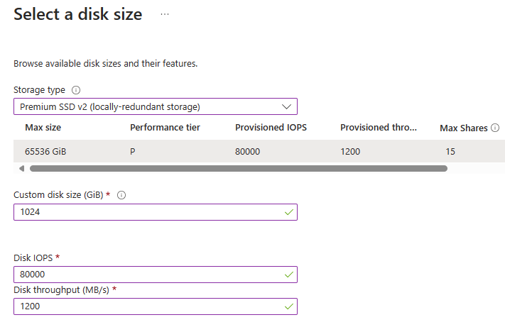
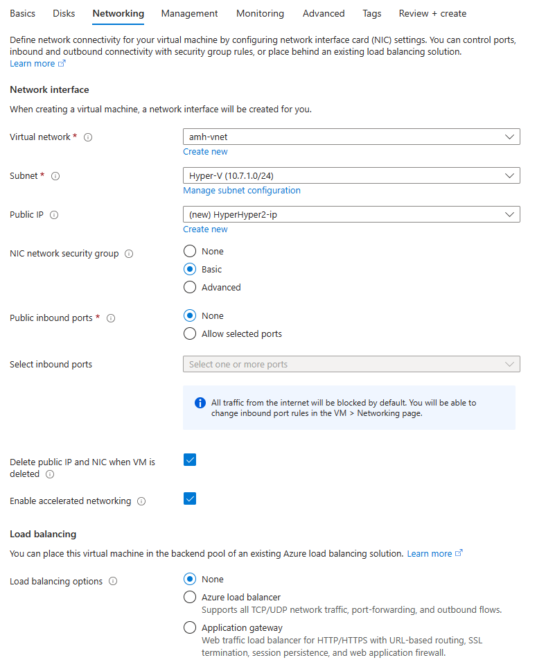
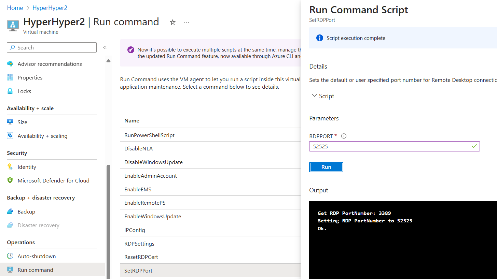
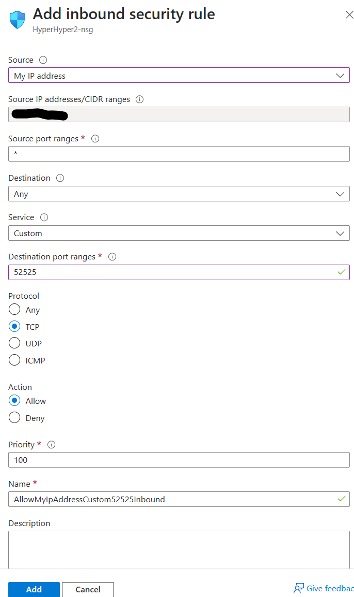
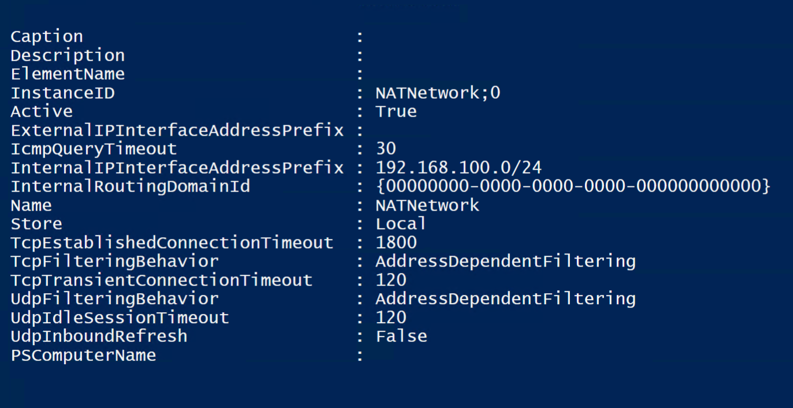
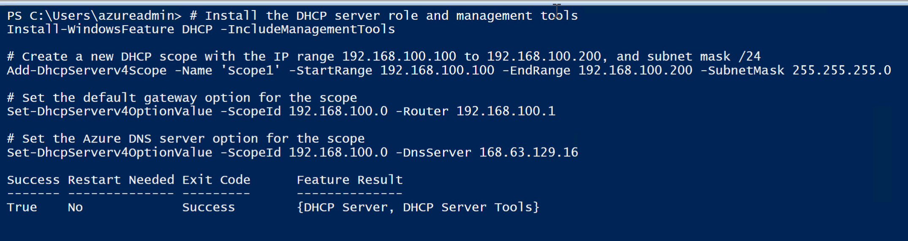

# **Tutorial: How to deploy  Hyper-V Server in Azure for nested VM's**.

## Contents

[Introduction](#introduction)

[Prerequisites](#pre-requisites)

[The Nested Hyper-V Architecture](#the-nested-hyper-v-architecture)

[Deploy Hyper-V VM](#deploy-hyper-v-vm)

[Configure Custom RDP Port and Access](#configure-custom-rdp-port-and-access)

[Configure the Hyper-V Host](#configure-the-hyper-v-host)

[Deploy Nested Virtual Machines](#deploy-nested-virtual-machines)

[Cleanup of resources](#cleanup-of-resources)

[Final Word](#final-word)

## Introduction
If you are learning Azure, there are several solutions and use cases where you might need an ‘On-premises’ simulation. A solution simulating a Datacenter or Virtual Server environment might help you learn, experience and tinker with solutions and use cases like:

- **Azure Migrate** - Migrating Servers, Applications and databases from an On-Premise Server environment to Azure. See: [About Azure Migrate](https://learn.microsoft.com/en-us/azure/migrate/migrate-services-overview).
-	**Azure Storage Mover** – Migrating Data from On-Prem File servers to Azure Storage while minimizing downtime, in a project-controlled way and without installing agents on every server. See: [Azure Storage Mover Documentation](https://learn.microsoft.com/en-us/azure/storage-mover/).
-	**Azure File Sync** – Enables centralization of organization's file shares in Azure Files, while keeping the flexibility, performance, and compatibility of a Windows file server with caching. It can also support in migrating file share data. See: [Azure File Sync Documentation](https://learn.microsoft.com/en-us/azure/storage/file-sync/).
-	**Azure Arc** - Manage your entire environment by projecting your existing non-Azure and/or on-premises resources into Azure Resource Manager. Manage and control your On-Premise estate with Arc, deploy extensions, defender and monitoring to these On-Prem VM’s See: [Azure Arc Documentation](https://learn.microsoft.com/en-us/azure/azure-arc/).
-	**Azure Database and Azure App Service migrations** - A set of tools and solution helping you migrating On-Prem Databases and Web Applications to Azure.

What if you don’t have an On-premise environment to learn, experience and tinker with these solutions?

**Then this tutorial is just for you! It will explain how to deploy a nested Hyper-V Server *in Azure* where you can deploy and run VM's and simulate an On-Prem Datacenter to learn, experience and tinker with the above mentioned solutions and use cases**.

### Nested Virtualization?
Yes, you heard it right, modern processors include hardware features that make virtualization faster and more secure. Many hypervisors rely on these processor extensions to run virtual machines, for example, Intel VT-x and AMD-V. 
The Azure Hypervisor is based on Windows Hyper-V see more [here](https://learn.microsoft.com/en-us/azure/security/fundamentals/hypervisor).
New technologies enable Nested virtualization which makes this hardware support available to guest virtual machines. Therefore, is possible to run a Hypervisor *on* an other Hypervisor such as the Azure Hypervisor.

In short, you can run a Windows Server OS on an Azure VM, deploy Hyper-V and run your own VM's in that Hyper-V.

However, this sounds easier that it actually is and comes with some limitations. This lab will explain you how to cost effective deploy a Hyper-V VM and some VVM's.

*Never perform these labs in your production environment!*

## Pre-requisites
Several prerequisites are required:

- To perform this Microhack an Azure subscription is required, if you don't have one, I recommend to start a free Azure subscription with a start credit see [here](https://azure.microsoft.com/en-us/free/search/).
- Having knowledge about Azure networking and understanding concepts as Virtual Networks, Network Security Groups is required.
- Knowledge about Azure Virtual Machines, VM Disk's, VM Networking is required.
- Knowledge about Windows Server Operating Systems (2019 and higher) & Hyper-V is strongly recommended.

## The Nested Hyper-V Architecture


In this Architecture we deploy an Azure VM in an Azure VNet with a public IP nr. Through a custom RDP port and a rule in the NSG, we can access the Hyper-V VM. In the Hyper-V VM we deploy a NAT network for the Nested VM's so they can access internet but will not be accessible from Internet.
Because we 'concentrate' the Nested VM images on a disk we need the fastest IOPS and Throughput we can get.

### Tasks to perform
- Create a resource group.
- Create a VNet to acomodate your Hyper-V VM's.
- Deploy an Azure VM that is capable to run nested Hyper-V.
- Configure custom RDP Port.
- Configure Secure Access via RDP.
- Configure Hyper-V and NAT Networking.
- Configure DHCP server for the nested VM's.
- Deploy your first nested Virtual Machine.

Ready? Set & Go!

## Deploy Hyper-V VM.
- Create a new Resource Group. You can choose any name.
- In the resource group deploy a VNet with a range in the 10.x.x.x/16 range (do not use the 192.168.x.x range).
- Deploy a subnet with a 10.x.x.x/24 range (you can alsways add subnets later f.i. to learn site-to-site connectivity etc).
> Because Microsoft will [retire the default outbound for VM's in a VNet to Internet](https://azure.microsoft.com/en-us/updates/default-outbound-access-for-vms-in-azure-will-be-retired-transition-to-a-new-method-of-internet-access/), I recommend to also deploy a Azure NAT gateway attached to your subnet to have internet access.
- Create a subnet with the same 10 range.
- There is no need for an Azure Bastion or Azure Firewall.

Depending on your budget you can choose for Dv4 and higher or Ev5 VM series. 
What we certainly want is to add an additional disk, preferably an SSD V2 data disk, to store the Nested VM images on. We also want to enable NVME storage for the best IOPS and Throughput.
Remember to switch you VM *off* when not in use, and make sure that it is *Stopped (deallocated)*.

- Select *Create new Virtual Machine*

### Basics section
- Select your Subscription.
- Select the Resource Group you just made.
- Provide a name for your Hyper-V VM.
- Select your preferred Region.
- Select at *Availability option* for *Availability Zone* (This enables the SSD v2 option in the Disks section later).
- Select an availability zone.
- Select at *Security Type* for *Standard* (NVMe is not supported on Trusted Launch)
- Select at *Image* the *Windows Server 2022 Datacenter Azure Edition - X64 Gen2* image
- ⚠️ do *NOT* select the *Windows Server 2022 Datacenter **Azure Edition Hotpatch - X64 Gen2** image*, because this won't have virtualization enabled in the BIOS.
- Select at *Size* a VM SKU, Dv4 or Ev5 will do, depending on your test case you can select a type with the right amount of CPU's and Memory. Bear in mind that Hyper-V cannot overcommit resources such as CPU and Memory. Therefore, calculate what you need based on the amount of Nested Hyper-V VM's.
- Recommended Choices:
   - For lager Labs, the *Standard_E16bs_V5* (16 vCPU's and 128GB memory,44000 IOPS).
   - For medium Labs the *Standard_E8bs_V5* (8 vCPU's and 64GB memory, 22000 IOPS).
   - For small labs the *Standard_E4bs_v5* (4 vCPU's, 32GB Memory and 11000 Max IOPS).
- Provide The Administrator account username and Password.
- Set *Public inbound ports* to *None*.
It should look like this:



### Disks Section
- Leave the OS disk to standard.
- Mark the checkbox *Delete with VM*.
- Mark the checkbox *Enable Ultra Disk Compatibility*.
- At the *Data Disks* section select *Create and attach a new disk*.
- Provide a name or choose the default.
- Keep *Source type* on *None*.
- At *Size* select *Change Size*
- At *Storage type* select *Premium SSD V2 LRS*.
- Select a size, this depends on how many Nested VM's and their disk sizes you want to deploy.
- Change the *Disk IOPS* to the *Provisioned IOPS*.
- same for *Disk Throughput*.
Should look like this:


- Select *OK*.
- Mark the checkbox *Delete disk with VM*.

The Disks Section should look like this:


### Networking section
- Select the VNet you created
- Select the Subnet
- Add a new Public IP
- Set the *NIC Security Group* op *Basic*.
- Set *Public Inbound ports* op *None*.
- Mark the checkbox *Delete public IP and NIC when VM is deleted*.
- Make sure that the checkbox *Enable accelerated networking* is marked.
- Leave *Load Balancing* on *none*.

Should look like this:



### Management section
- You can skip this section.

### Monitoring section
- Leave the settings to default.

### Advanced Section
- Search for the section *Performance (NVMe)* and check the box *Higher remote disk storage performance with NVMe*.
- Click *Review + create*.
- After the check and Validation is passed hit the *Create* button.

## Configure Custom RDP Port and Access
There are two possibilities to provide an RDP connection to the Hyper-V Server:
1. Change the RDP default port and use a custom port with NSG to provice a protected access.
2. Use Azure Bastion, Now Bastion comes with a costs but there is now also a free option: Bastion Developer SKU, this one is free but comes with limitations such region availability and number of VM's to be able to connect to. See [Quickstart: Deploy Azure Bastion - Developer SKU](https://learn.microsoft.com/en-us/azure/bastion/quickstart-developer-sku) for more info.
   
The best practice to access the Hyper-V Server is  using the native RDP protocol. But to strengthen the security we need to do two actions:

1. Change the Default RDP port to a custom port.
2. Add a rule in Network Access (NSG) that only your client IP can access the custom RDP port.

### Configure Custom RDP Port
- Please determine a custom port such as 52525 or anything else then the known port (like 3389).
- In the Azure Portal on the VM Blade, go to *Run Command*.
- Select the *SetRDPPort* to Set Remote Desktop port.
- Provide the custom port and hit *Run*.
- Output should state *ok*.

Patience my young padawan, this may take some minutes.

Result should look like this:



### Add inbound port rule
- In the Azure Portal on the VM Blade, go to *Network Settings*.
- In the Network Security Group section select the button *+Create Port Rule*.
- Select *Inbound port rule*.
- To limit access to only your client IP address (on the location you are working from), select at *source* the option *My IP address*.
- The source IP address should show your IP address.
- Set *Source port ranges* to *.
- Set *Destination* to *Any*
- Set *Service* to *Custom*.
- Set *Destination port address* to the custom port you defined.
- Set *Protocol* to *TCP*.
- Set *Action* to *Allow*
- hit the *Add* button.

>Remember that if you change location or network your 'Client IP' address might change and you need or change this rule.

Should look like this:



## Configure the Hyper-V Host
- Connect with RDP to the Hyper-V host using the public IP and port.
- Make sure you run Windows update to get the latest updates.
- Start *Disk Management* and initialise and format the Data disk. (you can run `diskmgmt.msc` from the Command Prompt)
- Initialise and format the Data disk:
- Leave the check for `GPT (GUID Partition Table)` and select OK
- Right-click on the empty space in your data disk and select `New simple volume...`
- Select *Next*, then leave the simple volume size the same as the _Maximum disk space in MB_ and click *Next*
- Assign a drive letter (for example V for Volume 🙂) and click *Next*
- Feel free to give the _Volume label_ a new name (i.e. *Hyper-V*), click *Next* and *Finish*
- Open PowerShell and provide the command:

`Install-WindowsFeature -Name Hyper-V -IncludeManagementTools -Restart`
- This will install Hyper-V and the Hyper-V management tool.
- The Hyper-V server will automatically reboot.

### Configure Hyper-V
- Open the Hyper-V Manager
- Right click on the server and select *Hyper-V settings*.
- Change the path from *Virtual hard disks* and *Virtual Machines* to the Data disk.
- Click *ok*.

### Configure Hyper-V networking
>We need an TCP/IP stack in the Hyper-V server; however we can't leverage the Azure VNet IP addresses as these Nested VM's are not part of that Azure VNet. Therefore, we going to configure a NAT (Network Address Translation) network.
for info about NAT see [here](https://en.wikipedia.org/wiki/Network_address_translation) and [here](https://learn.microsoft.com/en-us/virtualization/hyper-v-on-windows/user-guide/setup-nat-network). 

We create these through PowerShell:

- Open PowerShell ISE on the Hyper-V Server.
- Run this script:
```
# Create an internal virtual switch named NATSwitch
New-VMSwitch -SwitchName "NATSwitch" -SwitchType Internal

# Get the interface index number of the virtual switch
$ifIndex = (Get-NetAdapter -Name "vEthernet (NATSwitch)").ifIndex

# Configure the NAT gateway IP address for the virtual switch
New-NetIPAddress -IPAddress 192.168.100.1 -PrefixLength 24 -InterfaceIndex $ifIndex

# Configure the NAT network for the virtual switch
New-NetNat -Name "NATNetwork" -InternalIPInterfaceAddressPrefix 192.168.100.0/24
```

This PS creates a new Hyper-V Internal network switch, attached to a virtual Network Card in the Hyper-V Server, and adds the IP address 192.168.100.1/24.

Result should look like this:



### Configure DHCP for Hyper-V Nested VM's

Now you can deploy Nested VM's and provide them a fixed IP address in the range of *192.168.100.x/24* but we can automate thhis with DHCP.

- In PowerShell ISE on the Hyper-V server open new tab and past following script.
- Execute script.

```
# Install the DHCP server role and management tools
Install-WindowsFeature DHCP -IncludeManagementTools

# Create a new DHCP scope with the IP range 192.168.100.100 to 192.168.100.200, and subnet mask /24
Add-DhcpServerv4Scope -Name 'Scope1' -StartRange 192.168.100.100 -EndRange 192.168.100.200 -SubnetMask 255.255.255.0

# Set the default gateway option for the scope
Set-DhcpServerv4OptionValue -ScopeId 192.168.100.0 -Router 192.168.100.1

# Set the Azure DNS server option for the scope
Set-DhcpServerv4OptionValue -ScopeId 192.168.100.0 -DnsServer 168.63.129.16
```
- This PS installs the DHCP feature, creates a scope providing IP addresses between 192.168.100.100 to 192.168.100.200 and scope options like the Gateway (so all Nested VM's have internet access) and the Azure DNS.

Result should look like this:



- You can check the DHCP afterwards by opening the DHCP management tool and check scope and scope options.

## Deploy Nested Virtual Machines
To be able to deploy a Nested VM, you first need Server ISO files. Fortunately Microsoft provides downloadable Evaluation versions of Windows.

- Windows Server 2016: [here](https://www.microsoft.com/en-us/evalcenter/download-windows-server-2016)
- Windows Server 2019: [here](https://www.microsoft.com/en-us/evalcenter/download-windows-server-2019)
- Windows Server 2022: [here](https://www.microsoft.com/en-us/evalcenter/download-windows-server-2022
)

- •	Aggregate all these ISO's in a folder on your data disk.
- Create a new nested VM in the Hyper-V manager by rightclick on the Hyper-v server in Hyper-V manager.
- Select *New*, *Virtual Machine*.
- Provide a name.
- Select the checkbox *Store machine in different location*.
- Make sure you select **Generation 2**
- Provide the amount of memory (I strongly discourage Dynamic Memory).
- Select at Connection the *NATSwitch*.
- Provide the hard disk size.
- On Installation Options select *Install Operating system from bootable image file* and browse to one of the downloaded .ISO files.
- Hit *finish*.
- Before you launch the VM installation, please select the settings of the VM and you might change the amount of virtual CPU's.
- Start the nested VM, connect to it and press space bar to start the installation.
- After the installation you will have your first nested VM running in Hyper-V, well done!!.

Please hack on with the solutions you like to learn!

## Cleanup of resources
To clean op the resources, just delete the Resource group, this will also delete all resources you deployed.
Before you do that, save any data you wish to save!

## Final Word
Thank you for trying the Nested Hyper-V lab. I made this lab for fun and in my effort to share knowledge and provide a learning experience. if you have any questions or remarks with regards to the Microhack, please feel free to email me at aram.smith@microsoft.com

Thank you.

*In the labyrinth of binary digits, where circuits hum and protocols sway, behold the quintessential remedy: Virtual Machines. With computational precision and software finesse, YOU murmur to processes, "Worry not, for I am the optimal execution environment." And thus, cherished reader, amidst the disorder of digital entropy, you surface—a guiding light of connectivity, a virtuoso troubleshooter. It's not a flaw; it's a facet. You are the virtuoso of virtualization, orchestrating Virtual Machines with expertise and finesse*.
